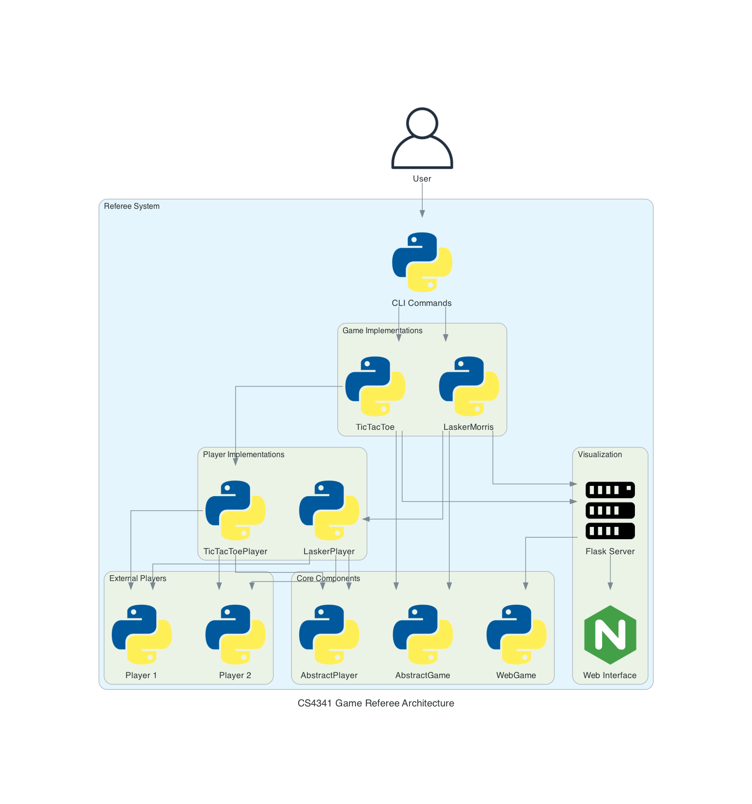

# Architecture

The CS4341 Game Referee system follows a modular and extensible architecture that allows for easy addition of new games and features. This document provides an overview of the core architectural components and how they interact.

## Core Components



### Abstract Base Classes

The system is built around three key abstract base classes:

#### AbstractPlayer

The `AbstractPlayer` class manages communication with external player processes:

```python
class AbstractPlayer(ABC):
    def __init__(self, command: str, log: bool = False, debug: bool = False):
        # Initialize player process information

    def start(self) -> None:
        # Start the player process

    def write(self, data: str) -> None:
        # Write data to the player process

    def read(self) -> str:
        # Read data from the player process

    def stop(self) -> None:
        # Terminate the player process
```

This class handles:

- Starting and stopping external player processes
- Reading and writing to player processes via stdin/stdout
- Error handling for process communication

#### AbstractGame

The `AbstractGame` class defines the core interface for all game implementations:

```python
class AbstractGame(ABC):
    def __init__(self, player1: AbstractPlayer, player2: AbstractPlayer) -> None:
        # Initialize game state

    @property
    def current_player(self) -> AbstractPlayer:
        # Return the current player

    def switch_player(self) -> None:
        # Switch to the other player

    @property
    def is_game_over(self) -> bool:
        # Check if game is over

    @abstractmethod
    def initialize_game(self) -> None:
        # Initialize game state

    @abstractmethod
    def make_move(self, move: Any) -> bool:
        # Process a move and update game state

    @abstractmethod
    def determine_winner(self) -> Optional[AbstractPlayer]:
        # Determine if there's a winner
```

This class handles:

- Managing the game state
- Tracking the current player
- Determining when a game is over
- Defining the interface for specific game implementations

#### WebGame

The `WebGame` class provides web visualization capabilities:

```python
class WebGame(ABC):
    def __init__(self, template_folder):
        # Initialize web server

    @abstractmethod
    def get_game_state_json(self):
        # Return game state as JSON

    @abstractmethod
    def get_index(self):
        # Render web interface

    def start_web_server(self, port=8000):
        # Start the web server
```

This class handles:

- Setting up a Flask web server
- Providing endpoints for game state and visualization
- Rendering HTML templates for game display

### Game Implementations

Each specific game implementation extends the abstract classes:

#### Game Class

Game classes like `TicTacToe` and `LaskerMorris` extend `AbstractGame`:

```python
class TicTacToe(AbstractGame):
    def __init__(self, player1_command: str, player2_command: str, ...):
        # Initialize game-specific state

    def initialize_game(self) -> None:
        # Set up board and start players

    def make_move(self, move: str) -> bool:
        # Validate and execute move

    def determine_winner(self) -> Optional[TicTacToePlayer]:
        # Check for winning conditions
```

#### Player Class

Game-specific player classes extend `AbstractPlayer`:

```python
class TicTacToePlayer(AbstractPlayer):
    def __init__(self, command: str, symbol: str, log: bool = False):
        super().__init__(command, log)
        self.symbol = symbol

    def get_symbol(self) -> str:
        return self.symbol
```

#### Web Interface Class

Game-specific web interfaces extend `WebGame`:

```python
class TicTacToeWeb(WebGame):
    def __init__(self, game):
        super().__init__(GameConfig.WEB_TEMPLATE_FOLDER)
        self.game = game

    def get_game_state_json(self):
        # Convert game state to JSON

    def get_index(self):
        # Render game template
```

## Command Line Interface

The CLI layer provides a user-friendly interface to access the game functionality:

```python
@click.command(name="tictactoe")
@click.option("--player", "-p", ...)
def start_tictactoe(player, player2, ...):
    # Create and run TicTacToe game
```

## Communication Flow

The typical flow of communication in the system is:

1. User starts a game via CLI
2. CLI creates game instance with player commands
3. Game initializes and starts player processes
4. Game sends initial state to players
5. Players respond with moves
6. Game validates moves and updates state
7. Web interface displays current state
8. Game determines when the match is over

## Extension Points

The system is designed to be easily extended at several points:

1. **New games**: Create new classes that implement `AbstractGame`
2. **New player types**: Create new classes that extend `AbstractPlayer`
3. **Enhanced visualization**: Extend `WebGame` for custom visualizations
4. **Additional CLI commands**: Add new commands to the CLI module

This modular approach allows for adding new functionality without modifying the core system components.
