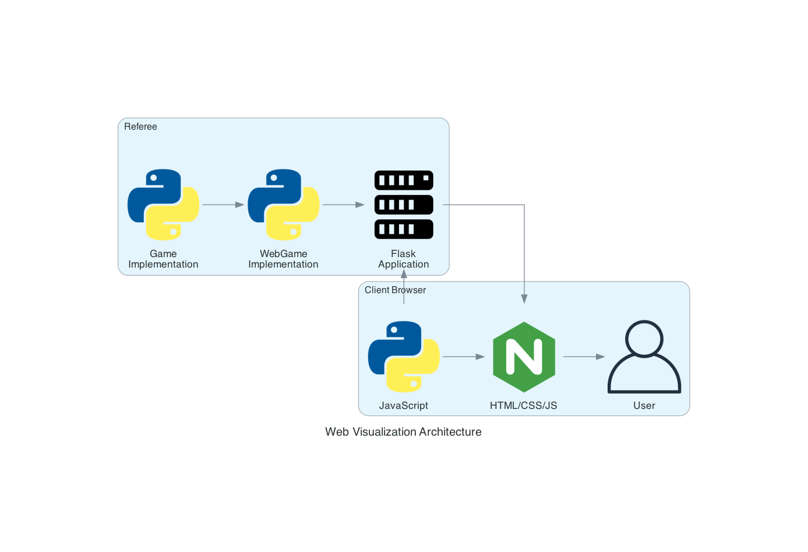

# Web Visualization

The CS4341 Game Referee system includes a powerful web-based visualization component that provides real-time insight into game states, move history, and results. This document explains how the visualization system works and how to extend it for new games.

## Overview

The visualization system consists of:

1. **Server-Side**: Flask application serving game state and HTML templates
2. **Client-Side**: HTML, CSS, and JavaScript for rendering the game
3. **Communication**: JSON API for real-time state updates

## Architecture



The visualization is built on these core components:

- **WebGame**: Abstract base class for web interfaces
- **Game-Specific Web Classes**: Implementations for each game (e.g., TicTacToeWeb)
- **HTML Templates**: Game-specific templates in the `web/` directory
- **JSON API**: Endpoint for retrieving current game state
- **Waitress Server**: Production WSGI server for hosting the web interface

## How It Works

When a game is run with the `--visual` flag:

1. The game creates a web interface instance (`WebGame` subclass)
2. A Flask app is initialized with the game's template folder
3. The web server starts in a separate thread
4. Two main routes are defined:
   - `/`: Renders the HTML template
   - `/game-state`: Returns the current game state as JSON
5. The client-side JavaScript polls for game state updates
6. The visualization updates in real-time as the game progresses

## WebGame Class

The `WebGame` abstract base class provides the foundation for web visualization:

```python
class WebGame(ABC):
    """Abstract base class for web-enabled games"""

    def __init__(self, template_folder):
        from flask import Flask
        from flask_cors import CORS

        self.app = Flask(__name__, template_folder=template_folder)
        CORS(self.app)
        self.game_history = []
        self.app.route("/")(self.get_index)
        self.app.route("/game-state")(self.get_game_state_json)

    @abstractmethod
    def get_game_state_json(self):
        pass

    @abstractmethod
    def get_index(self):
        pass

    def start_web_server(self, port=8000):
        import threading
        from click import echo
        from waitress import serve

        url = f"http://localhost:{port}"
        echo(f"\n🎮 Game visualization available at: 🌐 {url}")
        threading.Thread(
            target=lambda: serve(self.app, host="0.0.0.0", port=port), daemon=True
        ).start()
```

## HTML Templates

Each game requires an HTML template in the `src/web/{game_name}/index.html` directory. The template receives game state data via Jinja2 templating.

A typical template includes:

1. **HTML Structure**: Board layout and game controls
2. **CSS Styling**: Visual appearance of the game elements
3. **JavaScript Functions**:
   - Initial state rendering
   - State update logic
   - API polling
   - User interaction (if needed)

## Game State JSON Format

The game state is provided as JSON with a structure similar to:

```json
{
  "board": {
    /* board state */
  },
  "currentPlayer": "blue",
  "isGameOver": false,
  "history": {
    "moves": [
      /* move history */
    ],
    "boards": [
      /* board history */
    ]
  },
  "endMessage": null
}
```

Each game can customize this structure to include game-specific data.

## Adding Visualization for a New Game

Follow these steps to add visualization for a new game:

### 1. Create a Web Interface Class

Create a game-specific web class that inherits from `WebGame`:

```python
class Connect4Web(WebGame):
    def __init__(self, game):
        super().__init__(GameConfig.WEB_TEMPLATE_FOLDER)
        self.game = game
        self.end_message = None

    def get_game_state_json(self):
        """Return current game state as JSON"""
        game_data = {
            "board": self.game.board,
            "currentPlayer": self.game.current_player.get_color(),
            "isGameOver": self.game.is_game_over,
            "history": self.game.moves_history,
            "endMessage": self.end_message if self.game.is_game_over else None,
        }
        return jsonify(game_data)

    def get_index(self):
        """Render template with game state data"""
        game_data = {
            "board": self.game.board,
            "currentPlayer": self.game.current_player.get_color(),
            "isGameOver": self.game.is_game_over,
            "history": self.game.moves_history,
            "endMessage": self.end_message if self.game.is_game_over else None,
        }
        return render_template("./connect4/index.html", game_data=game_data)
```

### 2. Create an HTML Template

Create a template in `src/web/{game_name}/index.html`:

```html
<!DOCTYPE html>
<html lang="en">
  <head>
    <meta charset="UTF-8" />
    <meta name="viewport" content="width=device-width, initial-scale=1.0" />
    <title>Game Name</title>
    <style>
      /* CSS styles for your game */
      body {
        font-family:
          system-ui,
          -apple-system,
          sans-serif;
        background: #f8fafc;
        color: #475569;
        padding: 2rem;
      }
      .board {
        /* Board styles */
      }
      /* Additional styles */
    </style>
  </head>
  <body>
    <div class="container">
      <header>
        <h1>Game Name</h1>
      </header>

      <div class="game-container">
        <div class="board" id="board">
          <!-- Board will be populated by JavaScript -->
        </div>

        <div class="controls">
          <div class="status" id="currentPlayer">
            Current Player: <span id="player"></span>
          </div>
          <!-- Additional controls -->
        </div>
      </div>
    </div>

    <script>
      // Initial game state from server
      let gameState = {{ game_data|tojson|safe }};

      function updateBoard() {
          // Update the visual representation of the board
          const board = document.getElementById('board');
          board.innerHTML = '';

          // Board rendering logic
          // ...

          // Update player information
          document.getElementById('player').textContent = gameState.currentPlayer;
      }

      async function fetchGameState() {
          try {
              const response = await fetch('/game-state');
              const data = await response.json();
              gameState = data;
              updateBoard();
          } catch (error) {
              console.error('Error fetching game state:', error);
          }
      }

      // Initial board update and polling setup
      updateBoard();
      setInterval(fetchGameState, 1000);
    </script>
  </body>
</html>
```

### 3. Update Game Class

In your game implementation, add a method to create the web interface:

```python
def _create_web_interface(self):
    from .web import Connect4Web
    return Connect4Web(self)
```

And in the `initialize_game` method, start the web server:

```python
def initialize_game(self) -> None:
    # Initialize board
    # Start player processes
    # ...

    # Start web server if visualization enabled
    if self.visual and self.web:
        self.web.start_web_server(self.port)
```

### 4. Update Core Imports

Add your web class to the imports in `src/core/__init__.py`:

```python
from .web import LaskerMorrisWeb, TicTacToeWeb, Connect4Web

__all__ = [
    # ...
    "LaskerMorrisWeb", "TicTacToeWeb", "Connect4Web",
    # ...
]
```

## Best Practices

### Performance

- Keep DOM manipulations minimal
- Use efficient selectors for DOM updates
- Consider using SVG for game boards
- Optimize JSON payload size for fast updates

### User Experience

- Use clear visual cues for game state
- Highlight the current player
- Animate transitions when possible
- Include move history and navigation
- Display clear win/loss/draw messages

### Responsive Design

- Design for both desktop and mobile
- Use flexible layouts with CSS Grid or Flexbox
- Test on different screen sizes
- Ensure text is readable on all devices

### Accessibility

- Use semantic HTML elements
- Include alt text for visual elements
- Ensure sufficient color contrast
- Support keyboard navigation where applicable

## Advanced Visualization Features

Consider these advanced features for your game visualizations:

### Move Animation

Animate pieces moving between positions for better visual clarity:

```javascript
function animateMove(source, target) {
  const piece = document.getElementById(`piece-${source}`);
  const sourcePos = getPositionCoordinates(source);
  const targetPos = getPositionCoordinates(target);

  piece.style.transition = "transform 0.5s ease-in-out";
  piece.style.transform = `translate(${targetPos.x - sourcePos.x}px, ${targetPos.y - sourcePos.y}px)`;

  setTimeout(() => {
    // Update actual board after animation
    updateBoard();
  }, 500);
}
```

### Game Replay

Add controls to replay the entire game:

```javascript
function replayGame() {
  let moveIndex = 0;
  const interval = setInterval(() => {
    if (moveIndex >= gameState.history.moves.length) {
      clearInterval(interval);
      return;
    }

    updateBoard(gameState.history.boards[moveIndex]);
    moveIndex++;
  }, 1000);
}
```

### Game Statistics

Display statistics about the game:

```javascript
function updateStatistics() {
  document.getElementById("move-count").textContent =
    gameState.history.moves.length;
  document.getElementById("blue-captures").textContent = countCaptures("blue");
  document.getElementById("orange-captures").textContent =
    countCaptures("orange");
  document.getElementById("game-time").textContent = formatGameTime();
}
```

By following these guidelines, you can create rich, interactive visualizations for your games that enhance the understanding and enjoyment of the CS4341 Game Referee system.
